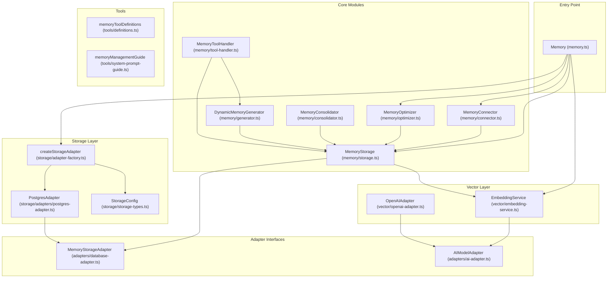
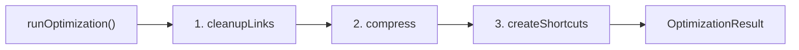
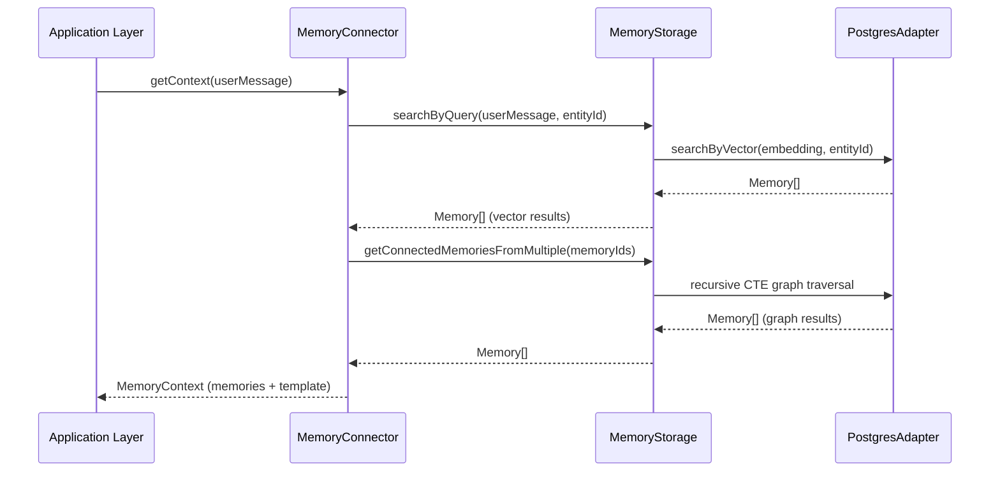

# @openaikits/memory Architecture

## Overview

`@openaikits/memory`는 entity별 associative memory network를 제공하는 infrastructure package입니다. vector embedding 기반 유사도 검색과 graph edge 기반 관계 탐색을 결합한 hybrid search를 핵심으로, 메모리의 생성·검색·최적화까지 제공합니다.

## Module Dependency Diagram



## Module Details

### Memory (memory.ts)

패키지의 진입점. Storage 초기화, Connector/Optimizer 인스턴스 생성을 담당합니다.

**Public API:**

| Method | Description |
|--------|-------------|
| `initialize(config, options)` | Storage adapter 생성 및 초기화. `StorageConfig`에 따라 적절한 adapter를 선택합니다. |
| `getStorage()` | 초기화된 `MemoryStorage` 인스턴스를 반환합니다. embedding 자동 생성이 포함된 고수준 API입니다. |
| `getAdapter()` | (deprecated) 저수준 `MemoryStorageAdapter`를 반환합니다. `getStorage()` 사용을 권장합니다. |
| `createConnector(config)` | `MemoryConnector` 인스턴스를 생성합니다. 채팅 연동에 사용합니다. |
| `createOptimizer()` | `MemoryOptimizer` 인스턴스를 생성합니다. 그래프 최적화에 사용합니다. |
| `close()` | 연결을 닫고 리소스를 정리합니다. |

**Usage:**

```typescript
import { Memory, StorageType, OpenAIAdapter } from '@openaikits/memory';

const memory = new Memory();

await memory.initialize(
  {
    type: StorageType.POSTGRES,
    connectionString: 'postgresql://...',
    schema: 'memory',
  },
  {
    aiAdapter: new OpenAIAdapter({ apiKey: '...' }),
  },
);

const storage = memory.getStorage();
const connector = memory.createConnector({ entityId: 'entity-123' });
const optimizer = memory.createOptimizer();

// 사용 후 정리
await memory.close();
```

---

### MemoryStorage (memory/storage.ts)

메모리 CRUD, 벡터 검색, 그래프 탐색을 제공하는 고수준 API. embedding 자동 생성을 내장합니다.

**Public API:**

| Method | Description |
|--------|-------------|
| `createMemory(memory, options?)` | 메모리 생성. embedding이 없으면 자동 생성합니다. |
| `getMemory(memoryId)` | UUID로 메모리 조회. |
| `updateMemory(memoryId, updates)` | 메모리 수정. content가 변경되면 embedding을 자동 재생성합니다. |
| `deleteMemory(memoryId)` | 메모리 삭제. |
| `getMemoriesByEntity(entityId)` | entity에 속한 모든 메모리 조회. |
| `searchByQuery(query, entityId, limit?, searchMode?)` | 텍스트 또는 embedding 벡터로 유사도 검색. `SearchMode` enum으로 임계값을 제어합니다. |
| `getConnectedMemories(memoryId, depth?)` | 단일 시작점에서 graph edge를 따라 연결된 메모리 탐색. |
| `getConnectedMemoriesFromMultiple(memoryIds, depth?)` | 복수 시작점에서 연결된 메모리 일괄 탐색. 중복 제거 포함. |
| `updateOutgoingEdges(memoryId, outgoingEdges)` | 메모리의 outgoing edge 배열을 갱신. 그래프 연결 관리의 핵심. |
| `getAllEntityIds()` | 등록된 모든 entity ID 목록 조회. |
| `recordEdgeTraversals(entityId, edges)` | edge 탐색 통계 기록. optimizer의 shortcut 판단에 사용됩니다. |
| `getEdgeTraversalStats(entityId)` | entity의 edge 탐색 통계 조회. traversal_count DESC 정렬. |

**Usage:**

```typescript
const storage = memory.getStorage();

// 메모리 생성 (embedding 자동 생성)
const mem = await storage.createMemory({
  entityId: 'persona-123',
  content: '서울에 살고 있어',
  outgoingEdges: [],
});

// 유사도 검색
const results = await storage.searchByQuery(
  '어디 살아?',
  'persona-123',
  10,
  SearchMode.NORMAL,
);

// 그래프 탐색
const connected = await storage.getConnectedMemories(mem.id, 2);
```

---

### MemoryConnector (memory/connector.ts)

Application Layer와 Memory Layer를 연결하는 bridge. 채팅 시 메모리 검색과 응답 후 자동 메모리 관리를 담당합니다.

**Public API:**

| Method | Description |
|--------|-------------|
| `connect(target)` | ChattingManager, callback, 또는 LangChain chain을 연결합니다. |
| `getContext(conversationContext)` | 대화 컨텍스트 기반 메모리 검색. vector search + graph traversal 결과를 통합 반환합니다. |
| `prepareContext(conversationContext)` | 연결된 ChattingManager를 통해 `getContext()`를 호출합니다. |
| `handleAfterResponse(context)` | 응답 후 LLM에 대화 맥락을 보내 create/update/updateLink/delete 판단을 위임합니다. `contextAdapter`가 필요합니다. |
| `createMemory(content, options?)` | 수동 메모리 생성. |
| `updateMemory(memoryId, content)` | 수동 메모리 수정. |
| `deleteMemory(memoryId)` | 수동 메모리 삭제. |
| `updateMemoryLink(fromId, toId, action)` | 수동 edge 추가/제거. |

**Config:**

```typescript
interface MemoryConnectorConfig {
  entityId: string;                        // 필수: 대상 entity ID
  chainDepth?: number;                     // 그래프 탐색 깊이 (기본: 10)
  mode?: 'read-only' | 'read-write';       // 읽기 전용 또는 읽기/쓰기 (기본: 'read-write')
  maxMemoryCount?: number;                 // 최대 검색 수 (기본: 50)
  similarityThreshold?: SearchMode;        // 유사도 임계값 (기본: CONSERVATIVE)
  contextAdapter?: AfterResponseContextAdapter; // LLM adapter (read-write 모드에 필요)
  verbose?: boolean;                       // 로그 출력 (기본: false)
}
```

**Usage:**

```typescript
const connector = memory.createConnector({
  entityId: 'persona-123',
  mode: 'read-write',
  contextAdapter: myLLMAdapter,
});

// 검색 (invoke 전)
const context = await connector.getContext('사용자 메시지');

// 응답 후 자동 메모리 관리
await connector.handleAfterResponse({
  messages: [...conversationHistory],
  entityId: 'persona-123',
});
```

---

### MemoryConsolidator (memory/consolidator.ts)

entity의 메모리 간 논리적 관계를 분석하여 link를 생성합니다. 인간의 수면 중 기억 통합과 유사한 역할입니다.

**Public API:**

| Method / Function | Description |
|-------------------|-------------|
| `MemoryConsolidator.consolidateMemories(entityId, options)` | 클래스 메서드. entity의 모든 메모리를 LLM에 보내 관련 메모리 간 link를 생성합니다. |
| `consolidateMemories(storage, entityId, options)` | Convenience function. 내부에서 MemoryConsolidator를 생성하고 실행합니다. |

**Options:**

```typescript
interface ConsolidateMemoriesOptions {
  contextAdapter: AfterResponseContextAdapter; // LLM adapter (필수)
  bidirectional?: boolean;                     // 양방향 link 생성 (기본: true)
  batchSize?: number;                          // LLM당 최대 메모리 수 (기본: 50)
  onProgress?: (progress) => void;             // 진행 상황 콜백
  verbose?: boolean;                           // 로그 출력 (기본: false)
}
```

**Usage:**

```typescript
import { consolidateMemories } from '@openaikits/memory';

const result = await consolidateMemories(storage, 'persona-123', {
  contextAdapter: myLLMAdapter,
  bidirectional: true,
  verbose: true,
});
// result: { success, memoriesProcessed, linksCreated, createdLinks, durationMs }
```

---

### MemoryOptimizer (memory/optimizer.ts)

메모리 그래프를 최적화합니다. 압축(compress), 경로 단축(shortcut), 엣지 정리(cleanup) 3가지 전략을 제공하며, 각 전략은 LLM에 판단을 위임합니다.

**Public API:**

| Method / Function | Description |
|-------------------|-------------|
| `MemoryOptimizer.compress(entityId, options)` | 관련 메모리 그룹을 요약 노드로 병합. 원본은 보존됩니다. |
| `MemoryOptimizer.createShortcuts(entityId, options)` | edge traversal 통계와 의미적 관계를 분석하여 shortcut edge를 추가합니다. |
| `MemoryOptimizer.cleanupLinks(entityId, options)` | 의미적으로 약하거나 모호한 edge를 제거하고, 필요시 대체 edge를 추가합니다. |
| `MemoryOptimizer.runOptimization(entityId, options)` | 3가지 전략을 순차 실행합니다 (cleanup → compress → shortcut). `scope`로 특정 전략만 실행 가능. |
| `optimizeMemories(storage, entityId, options)` | Convenience function. `runOptimization()` wrapper. |
| `compressMemories(storage, entityId, options)` | Convenience function. `compress()` wrapper. |
| `createMemoryShortcuts(storage, entityId, options)` | Convenience function. `createShortcuts()` wrapper. |
| `cleanupMemoryLinks(storage, entityId, options)` | Convenience function. `cleanupLinks()` wrapper. |

**Optimization Flow:**



**Result Types:**

| Type | Fields |
|------|--------|
| `CompressResult` | `success`, `compressedNodesCreated`, `createdMemories`, `error?`, `durationMs` |
| `ShortcutResult` | `success`, `shortcutsCreated`, `createdShortcuts`, `error?`, `durationMs` |
| `CleanupResult` | `success`, `linksRemoved`, `linksAdded`, `error?`, `durationMs` |
| `OptimizationResult` | `compressedNodesCreated`, `shortcutsCreated`, `linksRemoved`, `durationMs` |

**Usage:**

```typescript
import { optimizeMemories, compressMemories } from '@openaikits/memory';

// 전체 최적화
const result = await optimizeMemories(storage, 'persona-123', {
  scope: 'all',
  contextAdapter: myLLMAdapter,
  verbose: true,
});

// 압축만 실행
const compressResult = await compressMemories(storage, 'persona-123', {
  contextAdapter: myLLMAdapter,
});
```

---

### DynamicMemoryGenerator (memory/generator.ts)

메모리 생성 시 관련 컨텍스트를 수집합니다. vector search + graph traversal로 augmentation data를 제공합니다.

**Public API:**

| Method | Description |
|--------|-------------|
| `collectAugmentation(query, entityId, options?)` | 텍스트 쿼리 기반으로 관련 메모리를 수집합니다. `AugmentationData` (vectorMemories + graphMemories) 형태로 반환. |

**Usage:**

```typescript
const generator = new DynamicMemoryGenerator(storage);
const augData = await generator.collectAugmentation(
  '새 메모리 내용',
  'persona-123',
  { maxDepth: 2, limit: 50 },
);
// augData.vectorMemories: 유사도 검색 결과
// augData.graphMemories: 그래프 탐색 결과
```

---

### MemoryToolHandler (memory/tool-handler.ts)

AI tool calling 요청을 처리하는 handler. LLM의 tool call을 받아 실제 메모리 작업을 수행합니다.

**Public API:**

| Method | Description |
|--------|-------------|
| `handleCreateMemory(params)` | 메모리 생성 + 선택적 link 연결. |
| `handleUpdateMemory(params)` | 메모리 내용 수정 (embedding 자동 재생성). |
| `handleUpdateMemoryLink(params)` | edge 추가/제거. |
| `handleDeleteMemory(params)` | 메모리 삭제 + 연결된 edge 정리. |

모든 메서드는 `ToolHandlerResult<T>`를 반환합니다: `{ success, data?, error? }`

**Usage:**

```typescript
const handler = new MemoryToolHandler(storage);

const result = await handler.handleCreateMemory({
  content: '서울에 살고 있어',
  entityId: 'persona-123',
  relatedMemoryIds: ['existing-memory-id'],
});
```

---

### Tool Definitions (tools/)

OpenAI Function Calling 형식의 tool 정의와 system prompt guide를 제공합니다.

**Exports:**

| Export | Description |
|--------|-------------|
| `memoryToolDefinitions` | Tool 정의 배열 (createMemory, updateMemory, updateMemoryLink, deleteMemory, logMemoryDecision) |
| `memoryManagementGuide` | System prompt에 포함할 메모리 관리 가이드 텍스트 |

**Usage:**

```typescript
import { memoryToolDefinitions, memoryManagementGuide } from '@openaikits/memory';

// LLM에 tool binding
const model = chatModel.bindTools(memoryToolDefinitions);

// System prompt에 가이드 추가
const systemPrompt = `${basePrompt}\n\n${memoryManagementGuide}`;
```

---

### Adapter Interfaces

#### MemoryStorageAdapter (adapters/database-adapter.ts)

데이터베이스 작업을 추상화하는 인터페이스. 모든 storage 구현체가 이 인터페이스를 준수합니다.

| Method | Description |
|--------|-------------|
| `createMemory(memory)` | 메모리 생성 |
| `getMemory(memoryId)` | UUID로 조회 |
| `updateMemory(memoryId, updates)` | 메모리 수정 |
| `deleteMemory(memoryId)` | 메모리 삭제 |
| `getMemoriesByEntity(entityId)` | entity별 전체 조회 |
| `searchByVector(embedding, entityId, limit?, threshold?)` | 벡터 유사도 검색 |
| `getConnectedMemories(memoryId, depth?)` | 단일 시작점 그래프 탐색 |
| `getConnectedMemoriesFromMultiple(memoryIds, depth?)` | 복수 시작점 그래프 탐색 |
| `updateOutgoingEdges(memoryId, outgoingEdges)` | edge 배열 갱신 |
| `updateEmbedding(memoryId, embedding)` | embedding 갱신 |
| `getAllEntityIds()` | 전체 entity ID 목록 |
| `recordEdgeTraversals(entityId, edges)` | edge 탐색 통계 기록 |
| `getEdgeTraversalStats(entityId)` | edge 탐색 통계 조회 |

#### AIModelAdapter (adapters/ai-adapter.ts)

AI 모델 작업을 추상화하는 인터페이스. embedding 생성, 메모리 생성, 일관성 검증에 사용됩니다.

| Method | Description |
|--------|-------------|
| `generateEmbedding(text)` | 단일 텍스트 embedding 생성 |
| `generateEmbeddings(texts)` | 복수 텍스트 embedding 일괄 생성 |
| `generateMemory(prompt, context?)` | AI 기반 메모리 내용 생성 |
| `validateConsistency(newMemory, existingMemories)` | 새 메모리와 기존 메모리 간 일관성 검증 |

#### AfterResponseContextAdapter (types.ts)

LLM completion을 위한 경량 adapter. Connector와 Optimizer가 내부적으로 사용합니다.

```typescript
interface AfterResponseContextAdapter {
  generate(messages: Array<{ role: string; content: string }>): Promise<string>;
}
```

---

### Storage Layer (storage/)

#### StorageConfig (storage/storage-types.ts)

Discriminated union으로 storage type별 config를 분리합니다.

```typescript
type StorageConfig = PostgresStorageConfig | TxtFileStorageConfig;

// PostgreSQL (구현 완료)
interface PostgresStorageConfig {
  type: StorageType.POSTGRES;
  connectionString: string;
  schema?: string;           // 기본: 'memory'
  autoMigrate?: boolean;
  migrationsPath?: string;
}

// Text file (미구현)
interface TxtFileStorageConfig {
  type: StorageType.TXT_FILE;
  directory: string;
}
```

Type guard: `isPostgresConfig(config)`, `isTxtFileConfig(config)`

#### createStorageAdapter (storage/adapter-factory.ts)

`StorageConfig`를 받아 적절한 `MemoryStorageAdapter` 구현체를 생성하는 factory function.

#### PostgresAdapter (storage/adapters/postgres-adapter.ts)

PostgreSQL + pgvector 기반 `MemoryStorageAdapter` 구현체. 자동 마이그레이션, 벡터 검색, BFS 그래프 탐색(recursive CTE)을 지원합니다.

---

### Vector Layer (vector/)

#### EmbeddingService (vector/embedding-service.ts)

`AIModelAdapter`를 사용하여 embedding 생성을 관리합니다. `MemoryStorage`가 내부적으로 사용합니다.

| Method | Description |
|--------|-------------|
| `generateEmbedding(text)` | 저장용 embedding 생성 |
| `generateQueryEmbedding(text)` | 검색 쿼리용 embedding 생성 |

#### OpenAIAdapter (vector/openai-adapter.ts)

OpenAI API를 사용하는 `AIModelAdapter` 구현체. text-embedding-3-small 모델을 기본으로 사용합니다.

---

## Data Flow Diagrams

### Memory Search (채팅 시)



### Memory Optimization

```mermaid
sequenceDiagram
  participant Trigger as Trigger (Manual/Cron)
  participant Opt as MemoryOptimizer
  participant LLM as LLM (contextAdapter)
  participant Storage as MemoryStorage

  Trigger->>Opt: runOptimization(entityId, options)

  Note over Opt: 1. Cleanup Links
  Opt->>Storage: getMemoriesByEntity(entityId)
  Storage-->>Opt: Memory[]
  Opt->>LLM: analyze edges for cleanup
  LLM-->>Opt: removeEdge/addEdge operations
  Opt->>Storage: updateOutgoingEdges()

  Note over Opt: 2. Compress
  Opt->>LLM: analyze memories for compression
  LLM-->>Opt: compress operations
  Opt->>Storage: createMemory() + updateOutgoingEdges()

  Note over Opt: 3. Create Shortcuts
  Opt->>Storage: getEdgeTraversalStats(entityId)
  Opt->>LLM: analyze graph + stats for shortcuts
  LLM-->>Opt: addEdge operations
  Opt->>Storage: updateOutgoingEdges()

  Opt-->>Trigger: OptimizationResult
```

## Core Types

### Memory

```typescript
interface Memory {
  id: string;              // UUID
  content: string;         // 자연어 텍스트
  entityId: string;        // entity ID (TEXT, UUID 아님)
  embedding?: number[];    // 벡터 임베딩
  outgoingEdges: string[]; // 연결된 메모리 UUID 배열
  similarity?: number;     // 검색 시 유사도 점수 (0-1)
  createdAt: Date;
  updatedAt: Date;
}
```

### SearchMode

```typescript
enum SearchMode {
  AGGRESSIVE = 0.2,   // 많은 결과, 탐색적 검색
  NORMAL = 0.5,       // 균형
  CONSERVATIVE = 0.7, // 적지만 정확한 결과 (기본값)
}
```

### OptimizerOperation

```typescript
type OptimizerOperation =
  | { action: 'compress'; sourceMemoryIds: string[]; compressedContent: string; linkTo?: string[] }
  | { action: 'addEdge'; fromMemoryId: string; toMemoryId: string }
  | { action: 'removeEdge'; fromMemoryId: string; toMemoryId: string };
```
