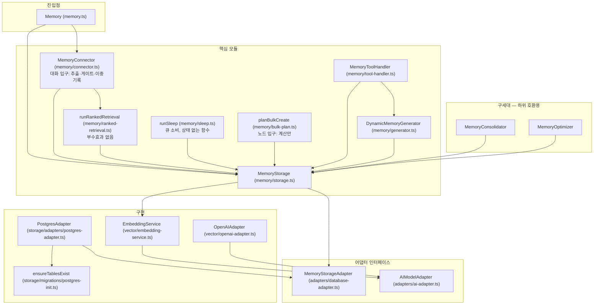

# 사용이 조각하는 메모리 — 유지보수 가이드

> 독자는 이 패키지를 유지보수하거나 내부를 이해하고 싶은 개발자다. "어디에 무엇이 있고,
> 무엇을 건드리면 무엇이 같이 움직이는지"를 적는다. 원리와 다이얼은
> `usage-carved-memory.ko.md`, 용어는 `usage-carved-memory-concepts.ko.md`, 운영 실측은
> `usage-carved-memory-technical-report.ko.md`, 도구 호출 방식은 `tool-definitions-usage.md`.
>
> 이 패키지는 범용 LLM 외부 메모리다. 호스트 애플리케이션 고유의 설정 저장소·관리
> 화면·배포 절차는 여기서 다루지 않고 **계약**만 적는다.

---

## 1. 지도 — 파일과 책임

| 경로 | 책임 | 건드릴 때 같이 볼 것 |
|---|---|---|
| `src/tuning.ts` | `MemoryTuning` 계약, 기본값, `normalizeMemoryTuning` 검증 | 필드를 추가하면 호스트의 키 파서와 문서 3곳(명세·철학·이 문서) |
| `src/memory/connector.ts` | 대화 입구. `handleAfterResponse`(추출→연산→게이트), `getContext`(모드 분기), 이중기록, 사용 부수효과, 내부 상수 | 밴드 판정을 바꾸면 `bulk-plan.ts`의 병렬 구현 |
| `src/memory/ranked-retrieval.ts` | `runRankedRetrieval`, `effectiveStrength`. **부수효과 없음** — shadow 경로가 재사용한다 | 부수효과를 여기 넣지 말 것 |
| `src/memory/bulk-plan.ts` | `planBulkCreate`. 배치 임베딩→밴드→맥락 엣지→시드. 쓰기 0 | 커넥터의 밴드 로직과 동기 |
| `src/memory/storage.ts` | `MemoryStorage` 파사드. 전부 어댑터 위임 | 메서드를 추가하면 `database-adapter.ts` 인터페이스 |
| `src/adapters/database-adapter.ts` | 어댑터 인터페이스 | |
| `src/storage/adapters/postgres-adapter.ts` | SQL 구현. bump·기록·큐 적재·엣지 CRUD | float4·clamp·GREATEST 규칙 |
| `src/storage/migrations/postgres-init.ts` | `ensureTablesExist`, `MEMORY_SCHEMA_VERSION`, advisory lock | `migrations/*.sql`과 쌍 |
| `migrations/*.sql` | 런타임 DDL의 SQL 파일 쌍. 각 파일 헤더가 적용 조건과 롤백을 설명한다 | |
| `src/memory/tool-handler.ts` | 도구 호출 경로(create/update/link/delete). delete는 강등으로 실행 | 커넥터의 연산 실행부와 의미 동기 |
| `src/memory/consolidator.ts`, `optimizer.ts` | 구세대 전량 투입 패스. 재설계가 대체한 경로이며 하위 호환을 위해서만 남는다 | 호스트 호출부가 남아 있는 동안 삭제 금지 |
| `src/memory/generator.ts` | `DynamicMemoryGenerator`(요청 시 보강 컨텍스트 수집) | |
| `src/tools/` | 도구 호출용 정의(`definitions.ts`)와 시스템 프롬프트 가이드 | `tool-definitions-usage.md` |
| `src/vector/` | `EmbeddingService`(어댑터 위에서 정규화·재시도), `OpenAIAdapter` | |
| `src/storage/adapter-factory.ts`, `storage-types.ts` | `StorageConfig`(discriminated union) → 어댑터 생성 | |

### 1-1. 모듈 의존 다이어그램



`Memory` 클래스는 초기화(스토리지 설정 + AI 어댑터)와 커넥터 생성만 맡는다. 잠자기와
벌크는 클래스를 거치지 않고 `MemoryStorage`를 받는 순수 함수다.

---

## 2. 데이터 모델과 불변식

### 2-1. 테이블

**`memories`** — 노드. 동적 컬럼 5개:

| 컬럼 | 기본 | 의미 |
|---|---|---|
| `strength` REAL | 0.5 | 저장 강도. 재언급 bump로만 오른다 |
| `strength_updated_at` | NOW() | **감쇠의 시계.** 강화될 때마다 리셋 |
| `retrieval_count` INT | 0 | 인출 횟수 (γ와 관측용) |
| `last_retrieved_at` | NULL | 마지막 인출 (γ의 시계) |
| `status` TEXT | 'active' | 'active' \| 'demoted'. 강등의 의미는 3-1 |

`outgoing_edges uuid[]`는 구세대 배열 엣지. 청산 전까지 남는다 (2-3).

**`edges`** — 1급 엣지. `(id, entity_id, from_id, to_id, type, origin, strength, created_at, strength_updated_at)`.
`UNIQUE(from_id, to_id, type)`, 양쪽 FK `ON DELETE CASCADE`. `type`은 관계의 뜻이고
`origin`은 판정 근거의 종류다. 두 축은 독립이다. `type`은 'related'를 기본으로 쓰고
'supersedes'(병합: 대표 → 강등 노드) \| 'summary_of'로 확장한다. `origin`은 2종뿐이다:

| origin | 근거 | 출생 강도 |
|---|---|---|
| `conversation` | 원문 맥락을 읽은 관계 판단(추출 LLM). 구세대 배열에서 이관된 행도 여기 | 0.7 |
| `knn_seed` | 임베딩 유사도 규칙. 게이트 시드, 회색지대 링크, **잠자기 v1 병합 판정**이 여기 | 유사도 (회색지대는 0.8) |

실행 주체(게이트·잠자기·운영자 버튼)는 origin에 적지 않는다. 근거가 같으면 같은 origin이다.
그 밖의 값('sleep', 'import', 'legacy')은 예약어이며 새 행에 쓰지 않는다. 엔티티를 복제할
때는 원본 행의 origin과 strength를 보존해 복사한다. **origin은 행동 분기용이
아니라 "자동 기록자의 서명"이다.** 랭킹·bump·감쇠는 origin을 보지 않는다.

**`sleep_jobs`** — 잠자기 큐 겸 감사 로그. `(id, entity_id, kind, payload JSONB, status, verdict JSONB, created_at, processed_at)`.
kind `merge_review`의 payload 키는 `newMemoryId`, `matchedMemoryId`, `similarity`.
status 전이는 `pending → processing → done | skipped | failed`. verdict는 종결 기록이며
재적재 경로는 없다.

**`gate_decisions`** — 게이트 판정 로그. create 시도당 1행. `decision`은 'created' \| 'would_skip'(shadow) \| 'skipped'(active).
스킵은 조용한 동작이라 이 로그 없이는 사후 검증이 불가능하다.

**`retrieval_shadow_log`** — legacy vs ranked diff. 인출 캘리브레이션이 끝나면 drop한다.

**`schema_version`** — 1행. 부팅 DDL 버전 게이트.

### 2-2. 불변식

| 불변식 | 비고 |
|---|---|
| edges에 dangling 없음 (FK) | `insertEdges`의 멀티 VALUES는 FK 위반 1건에 배치 전체가 실패한다. 호스트가 만드는 엣지는 양 끝 존재를 먼저 걸러야 한다 |
| 자기참조 엣지 없음 | 이관·복제 경로가 필터 |
| `strength ∈ (0, 1]` | bump는 `LEAST(1.0, …)`로 클램프 |
| **저장 강도를 낮추는 쓰기가 없다** | `insertEdges`의 ON CONFLICT는 `GREATEST`로 상향만. 대화 재확인이 시드 가설을 승격하되 하향은 없다. 강등은 status로만 표현한다 |
| 시스템 판단으로 노드를 물리 삭제하지 않는다 | 추출 LLM·도구 호출의 delete는 강등. 물리 삭제는 호스트의 명시 API뿐 |
| 전환기: 대화 유래 링크는 배열 ⊆ edges | 이중기록(2-3). 시드·회색 엣지는 edges에만 있어도 된다 |
| 스킵 노드 강도 = 0.5 + 0.1 × 스킵 횟수 | 관측 시 산수 대조 |

### 2-3. 전환기 구도 — 이중기록과 롤백 척추

`outgoing_edges` 배열은 청산(마지막 단계)까지 세 역할을 겸한다. legacy 인출의 서빙
그래프, edges 정합의 기준, 롤백의 척추. 대화 유래 링크(autoLink·updateMemoryLink·
ToolHandler)는 배열과 edges에 **동시에** 기록되고 이것은 인출 모드와 무관하게 상시
가동이다. 덕분에 어느 시점의 롤백도 데이터 역이관이 필요 없다. 인출 모드를 legacy로
되돌리면 배열이 스스로 최신이라 즉시 완전 복귀한다.

### 2-4. 함정

- **`strength`는 float4다.** `= 0.7` 비교가 실패한다(0.69999…). 반드시 `round(strength::numeric, 2)`.
- **감쇠 시계는 `strength_updated_at`이다.** `created_at`이 아니다. 배열 이관은 시계를
  출발 노드의 `updated_at`으로 설정하고(링크 나이 프록시), 동적 컬럼을 추가한 마이그레이션
  이전의 노드들은 시계가 마이그레이션 시각으로 단일하다(코호트 내 변별 없음).
- **관측은 저장값이 아니라 유효 강도로 한다.** `strength * exp(-λ * extract(epoch from (now()-strength_updated_at))/86400)`.

---

## 3. 요청 흐름

### 3-1. 읽기 — `getContext(conversationContext)`

`tuning.retrievalMode`로 분기한다.

- `legacy`: 구 경로 무수정 보존(strangler 패턴, 청산에서 삭제).
- `shadow`: legacy를 서빙하고, `runRankedRetrieval`을 부수효과 없이 병행 실행해 diff를
  `retrieval_shadow_log`에 기록(fire-and-forget).
- `ranked`: `runRankedRetrieval` 서빙. 부수효과 두 개를 fire-and-forget으로 —
  `recordNodeRetrievals`(반환된 노드의 인출 횟수·시각), `bumpEdgeStrengths`(기여 엣지 +0.05).

`runRankedRetrieval` 내부: 벡터 top-k 시드(k = limit, threshold 없음) → `getEdgesTouching`
으로 1-hop 이웃(무방향) → 노드별 최강 엣지 활성(유효 엣지강도 × 시드 유사도의 max) →
네 항 점수 → 정렬·절단 → 반환 노드에 기여한 엣지 id 목록.

**강등(`status = 'demoted'`)의 의미**: demoted 노드는 후보에서 제외되지 않는다. 점수에
강등 계수를 곱해 상위권에서 밀려날 뿐이며, 게이트의 재언급 bump가 status를 active로
되돌린다. 저장 강도는 건드리지 않는다.

### 3-2. 쓰기 — `handleAfterResponse(messages)`

1. 최근 대화 슬라이스 → 자체 인출로 "Existing memories" 작업 세트 구성.
2. 추출 LLM 호출 → 연산 배열 파싱. 허용 연산: `create`, `update`, `updateLink`, `delete`.
   ID는 작업 세트 안의 것만 유효.
3. **`create`만 게이트를 지난다.** `judgeDedupGate(content)`가 top-k(=seedK) 1회 조회로
   임베딩과 밴드 판정을 돌려준다(모드 무지 순수 판정). 모드 스위치는 호출부 한 곳:
   - `off`: 조회 자체를 생략.
   - `shadow`: 판정만 기록, 생성은 항상 진행.
   - `active`: 스킵 밴드면 생성 생략 + `bumpMemoryStrength(top, 0.1)`. 아니면 생성 후
     `applyPostCreateGateActions` — 회색지대면 최상위 이웃과 `knn_seed@0.8` 엣지 + `enqueueSleepJob(merge_review)`,
     그 외면 시딩 하한 이상 이웃 top-k에 `knn_seed@유사도` 엣지.
   - 판정 로그 `recordGateDecision`은 shadow·active 모두 fire-and-forget.
4. `update`는 내용 갱신. `updateLink add`는 배열+edges 이중기록(`conversation@0.7`),
   `remove`는 배열에서 제거 + edges 행 삭제. `delete`는 물리 삭제가 아니라 강등으로
   실행한다(`status = 'demoted'`). 물리 삭제는 호스트의 명시 API(`deleteMemory`)만 한다.

게이트 조회 실패는 생성을 막지 않는다(null 판정 → 생성 진행).

### 3-3. 벌크 — `planBulkCreate` / commit

plan은 순수 계산이다. 배치 임베딩(청크) → 밴드 판정(기존 노드 + 배치 내부, 스킵 리맵) →
원문에서 온 명시 관계(`relatedIndexes`)를 맥락 엣지로 → 시드(맥락 승리). 스킵 밴드만
적용하고 bump·회색 큐 적재는 하지 않는다(의도). commit은 plan 결과를 트랜잭션으로
적재한다 — 노드 INSERT, 명시 관계의 이중기록(`conversation@0.7`), 시드 벌크 INSERT.
plan과 commit을 나눈 이유는 적재 전에 통계와 엣지 목록을 사람이 검토할 수 있게 하기
위해서다.

### 3-4. 부수효과 표

| 부수효과 | 어느 경로 | 어느 모드 | 동기/비동기 |
|---|---|---|---|
| 노드 인출 기록 | getContext | ranked, legacy(수집 목적) | 비동기 |
| 기여 엣지 bump +0.05 | getContext | ranked만 | 비동기 |
| shadow diff 기록 | getContext | shadow만 | 비동기 |
| 노드 재언급 bump +0.1 | afterResponse | gate active | 동기 |
| kNN 시드 / 회색 엣지 / 큐 적재 | afterResponse | gate active | 동기 (실패해도 생성은 유지) |
| 게이트 판정 로그 | afterResponse | shadow·active | 비동기 |
| 배열+edges 이중기록 | afterResponse(link) | 모드 무관 | 동기 |

shadow 경로는 **부수효과 0**이어야 한다. `runRankedRetrieval`이 부수효과를 갖지 않는
이유가 이것이다.

---

## 4. 튜닝 계약

| 필드 | 범위 | 기본 |
|---|---|---|
| `dedupGateMode` | off \| shadow \| active | off |
| `dedupSkipThreshold` | (0, 1] | 0.97 |
| `dedupLinkThreshold` | (0, 1) | 0.85 |
| `seedSimilarityFloor` | (0, 1) | 0.6 |
| `seedK` | 1..20 정수 | 5 |
| `retrievalMode` | legacy \| shadow \| ranked | legacy |
| `rankWeightSimilarity` α | 0..10 | 1 |
| `rankWeightEdge` β | 0..10 | 0.3 |
| `rankWeightRecency` γ | 0..10 | 0.15 |
| `rankWeightStrength` δ | 0..10 | 0.15 |
| `decayLambda` λ | 0..1 | 0 |

- `normalizeMemoryTuning(partial)`: 잘못된 필드는 **그 필드만** 기본값으로 폴백하고 경고.
  `dedupLinkThreshold >= dedupSkipThreshold`면 두 임계값 모두 기본값.
- 호스트는 저장된 값만 partial로 넘긴다. 기본값·범위의 SSOT는 패키지다.
- 커넥터는 요청 단위로 생성되므로 값 변경이 다음 요청부터 반영된다. 호스트가 캐시를
  두면 그 TTL이 반영 지연이 된다.
- **제어 방식 결정 규칙**: 기존 실행 경로를 바꾸는 변경(게이트·인출)은 3-모드(off/shadow/
  active). 아직 소비자가 없는 신규 기능은 on/off + 수동 실행 도구. shadow는 기존 기능의
  보호 장치라 지킬 대상이 없는 곳에는 넣지 않는다.

---

## 5. 부팅·마이그레이션·롤백

### 5-1. 부팅

`ensureTablesExist(pool, schema)`는 전용 커넥션 1개를 잡고 `pg_advisory_lock` 아래에서
`schema_version`을 읽는다. `MEMORY_SCHEMA_VERSION`과 같으면 DDL 전체를 건너뛴다.
다르면 멱등 DDL을 전부 실행하고 버전을 갱신한다. 크로스-프로세스 콜드스타트 레이스는
advisory lock이 막고, 세션 락이 Pool의 다른 커넥션으로 새지 않도록 락과 DDL이 같은
커넥션에서 돈다. pgvector 타입 등록은 전역 레지스트리라 1회.

### 5-2. 스키마 버전 올리기

1. `postgres-init.ts`에 멱등 DDL 추가, `MEMORY_SCHEMA_VERSION` 증가.
2. `migrations/000N_<name>.sql` 작성(런타임 DDL의 거울, 말미에 `schema_version` upsert).
3. 역방향 SQL 작성(`000N_rollback.sql` 또는 헤더 주석).
4. 순수 추가(기본값 있는 ADD COLUMN, 새 테이블)만. 기존 읽기 행동은 바꾸지 않는다.

### 5-3. 롤백 모델

- **소프트 롤백이 기본.** 모드 토글 복귀 또는 코드 리버트만. edges 테이블은 남겨둬도
  legacy 코드가 참조하지 않아 무해하고, 쌓인 강도·시드가 보존돼 재롤포워드 시 무손실.
- **하드 롤백.** 역방향 SQL(테이블·컬럼 제거). 코드를 먼저 되돌린 뒤 실행.
- **edges는 파생 테이블이다.** 배열에서 재구축할 수 있다. 재해 시 선별 삭제가 아니라
  전소 후 재이관. 이관 규칙: 배열→edges 전량, `origin='conversation'`, `strength` 0.7
  균일, `strength_updated_at` = 출발 노드 `updated_at`, 멱등, 자기참조·dangling 제외,
  부팅 자동이 아닌 명시 실행.

---

## 6. 모드 전환 절차와 전제조건

| 전환 | 전제 | 검증 |
|---|---|---|
| 게이트 off → shadow | 없음 | `gate_decisions` 수집 |
| 게이트 shadow → active | would_skip 쌍 내용 대조에서 오탐 ~0 (극성 반전·갱신이 스킵될 뻔한 사례 0) | 이후 스킵 건은 매 관측마다 전건 대조 |
| 인출 legacy → shadow | 배열 이관 완료(β항이 완전한 그래프를 봐야 diff가 의미 있다) | `retrieval_shadow_log` overlap·차집합 내용 검토 |
| 인출 shadow → ranked | ① 배열 이관 ② 호스트의 엔티티 복제 경로가 edges도 미러링 | 회상 체감 수동 QA |
| λ 0 → 상향 | **λ=0으로 무개입 베이스라인을 먼저 수집** (λ>0 수집은 자기실현 오염) | 상향마다 유효 강도 지형 관측 |

게이트 shadow 모드는 삭제하지 않는다. 임계값이나 임베딩 모델을 바꿀 때 재검증 도구다.

---

## 7. 잠자기 실행기 — 계약

### 7-1. 실체

상주 프로세스가 아니라 **상태 없는 함수**다. 호출자가 둘이다.

- **호스트 수동 트리거** — 엔티티 단위. `dryRun`으로 판정 목록(유지·강등 내용 포함)을
  **아무것도 쓰지 않고** 먼저 받아 본 뒤, 같은 호출을 `force`로 실행해 적용한다. 판정 품질을
  사람이 검토하는 운용 방식이며, 자동 호출은 이 검토 뒤에 켠다.
- **사용 피기백** — 호스트가 대화 턴의 메모리 쓰기 뒤에 호출한다. 함수는 먼저 이
  엔티티의 큐를 한 번 세고(인덱스 카운트), 깊이·최고령 임계 미만이면 즉시 반환한다.
  대부분의 턴은 여기서 끝난다.

cron은 없다. 한 번 호출에 한 배치만 처리하고 남은 잡은 다음 호출을 기다린다.
조용한 엔티티의 비용은 0이다.

**롤아웃 게이트**는 기간이 아니라 횟수와 관찰로 잰다. ① 수동 미리보기→적용으로 쌓인
verdict **첫 100건을 전건 내용 대조**해 통과하면 피기백을 켠다(판정 품질은 횟수로
측정되는 게이트다). ② 자동 가동 **2주 관찰**(부활 이벤트·예산 리듬·인출 품질) 뒤에 소급
스캔을 승인한다. 게이트 스킵 감사와 같은 규약이다.

되돌리기는 상태만 복원하면 된다. 강등은 `status`, 병합 흔적은 `type = 'supersedes'` 엣지
(잠자기만 만든다)이며 노드·내용·기존 엣지는 손대지 않으므로 `status`를 active로 되돌리고 그
엣지를 지우면 실행 이전과 동일하다. 판정 기록(verdict)은 남겨 두어도 무해하다.

잠자기는 부가 기능이다. 새 축(origin 값, 점수 항, 저장소)을 도입하지 않고, 게이트와 랭킹이
쓰는 것과 같은 상태·같은 규칙 위에서만 동작한다.

### 7-2. 상한 4개 — 전부 큐 테이블에서 유도

| 상한 | 유도 |
|---|---|
| 쌍당 평생 1회 | verdict가 기록된 잡은 재적재하지 않는다 |
| 배치 크기 | 함수 인자 |
| 엔티티 쿨다운 (6시간) | 그 엔티티의 마지막 `processed_at` |
| 전역 예산 (200 / 24시간) | `processed_at >= now() - 24h`인 잡 수 |

별도 카운터 저장소가 필요 없다.

### 7-3. 판정 규칙 (규칙형, LLM 없음)

1. **사망 쌍**: 한쪽이라도 노드가 없으면 `skipped`로 마감. 호스트가 노드를 지울 때 큐를
   함께 정리하지 않아도 실행기가 견딘다.
   payload가 깨졌거나 kind를 모르는 잡도 `skipped`로 종결해 재claim되지 않게 한다.
2. **병합 밴드 이상**: 대표를 고른다(active > **내용이 긴 쪽** > 인출 횟수 많음 > 먼저 태어난
   쪽 — 정보 보존이 사용 증거보다 앞선다). 나머지를 강등(`status = 'demoted'`)하고 대표 → 강등
   노드 방향의 `supersedes` 엣지를 남긴다. 쓰기 순서는 **엣지 먼저, 강등 나중**(중간 실패 시
   무해한 가설 엣지만 남는다). 유사도 규칙의 산물이므로 origin은 `knn_seed`, 강도는 그
   유사도다(게이트 시드와 같은 규칙). `done` + verdict `{ kind: 'merge', keep, demote, similarity }`.
   같은 실행에서 앞 잡이 강등한 노드는 뒤 잡에서도 강등된 것으로 취급한다(실행 내 강등 집합).
   그래서 사슬로 얽힌 쌍도 미리보기와 적용이 같은 판정을 낸다.
3. **그 미만 회색지대**: 공존. 회색 엣지는 그대로 두고 `done` + verdict `{ kind: 'coexist' }`.
4. **claim**: `pending → processing` 원자 UPDATE(`FOR UPDATE SKIP LOCKED`), `processed_at`이 claim
   시각을 겸한다. 스테일 claim(기본 10분)은 재claim 가능해 실행기가 죽어도 잡이 좌초하지 않는다.
   완료 시 `processed_at`이 완료 시각으로 덮인다.

LLM 쌍 심사(재표현/모순/양립/무관)는 규칙형 위에 붙는 확장이다. 운영 표본에서 모순이
사실상 관찰되지 않아(실측 보고서 5-7) 규칙형만으로 시작한다.

### 7-4. 동시성

잡 claim은 `pending → processing` 원자 UPDATE. 못 바꾼 잡은 남이 집은 것이니 건너뛴다.
같은 엔티티의 연속 호출은 쿨다운이 막고, 겹쳐도 last-win. **호스트 확인 항목**: 호스트가
대화를 직렬화하는 락을 쥔 채 피기백을 돌리면 다음 발화가 그만큼 기다린다. 락 해제 뒤에
호출해야 한다.

### 7-5. 소급 스캔

게이트 도입 이전의 중복 쌍을 큐에 넣는 1회성 스크립트. verdict가 있는 쌍은 제외.
주기 작업이 아니다.

---

## 8. 관측 — 스코어보드

읽기 전용으로 스윕하고 전회 대비 델타로 본다. 항목과 판단 기준:

| 항목 | 무엇을 세나 | 판단 기준 |
|---|---|---|
| 게이트 생성/스킵 | `gate_decisions` decision별 | 신규 스킵은 매회 전건 내용 대조. 오탐 발생 시 즉시 보고 |
| 노드 bump 분포 | `round(strength,2)`별 노드 수 | 0.5 + 0.1×n 산수 |
| 엣지 bump / 포화 | `strength_updated_at > created_at + 1min` / `strength >= 0.999` | 포화 비중 30%+ 지속 시 bump 쿨다운·점감형 검토 |
| 시드 성숙 적중률 | `knn_seed` 중 생성 24h+ 경과분의 bump 비율 | 시드 하한·K 조정 근거 |
| λ 유효 지형 | 저장 밴드별 유효 강도 백분위 | λ 조정 근거 |
| 재사용 간격 | bump·인출 시각 − 생성 시각의 분포 | λ 반감기 하한 |
| sleep_jobs | status·kind·엔티티별·최고령·사망 쌍 비율 | 트리거 임계·실행기 부하 |
| 활동량 | 주간 게이트 판정 수·엔티티 수 | 다른 지표의 분모 |

자주 쓰는 식:

```sql
-- 유효 강도 (λ는 운영값 대입)
strength * exp(-0.01 * extract(epoch from (now() - strength_updated_at)) / 86400)

-- float4 함정 회피
round(strength::numeric, 2) = 0.70

-- 사망 쌍 (병합 심사 잡의 한쪽이 없어진 경우)
select count(*) from memory.sleep_jobs s
left join memory.memories a on a.id = (s.payload->>'newMemoryId')::uuid
left join memory.memories b on b.id = (s.payload->>'matchedMemoryId')::uuid
where s.kind = 'merge_review' and (a.id is null or b.id is null);
```

프로덕션 조회는 항상 `SET default_transaction_read_only = on`.

---

## 9. 검증 방법

이 패키지는 자동 테스트 대신 **결정론 검증 스크립트**로 검증한다.

- **가짜 임베딩**: 내용 → 축별 단위 벡터로 코사인을 설계한다. "이 두 문장은 0.98, 저
  둘은 0.88"을 미리 정해 밴드 판정을 결정론으로 만든다.
- **스텁 LLM 어댑터**: 고정 operations JSON을 돌려준다. afterResponse 전 경로를 오프라인
  구동.
- 실행: `node_modules/.bin/tsx`로 **소스(`src/*.ts`)를 직접** 구동. named import가 안
  되므로 `import mod from '...ts'; const { X } = mod;` 형태.
- 판정 로그·부수효과는 fire-and-forget이라 조회 전 ~300ms 대기.
- 호스트가 dist를 import하므로 소스를 바꾸면 `build`가 필요하다.
- 실데이터 판정 품질은 엔티티 1개를 로컬로 복제(임베딩 포함, 수 초)해 반복.
- 대용량은 복제가 아니라 합성(벌크 plan)으로 검증한다.

---

## 10. 구조적 주의점

- **밴드 판정이 두 곳에 있다.** 커넥터(대화 입구)와 `bulk-plan.ts`(노드 입구)는 튜닝
  SSOT를 공유하지만 판정 로직은 병렬 구현이다. 한쪽을 바꾸면 다른 쪽도 바꾼다.
- **shadow 경로는 무부수효과다.** 부수효과는 항상 호출부(커넥터)에서, 모드를 보고 붙인다.
- **배열은 청산 전까지 세 역할을 겸한다.** 서빙 그래프·정합 기준·롤백 척추. 배열을
  건드리는 변경은 세 역할 모두를 검토한다.
- **δ와 γ는 겹칠 수 있다.** 노드 강도가 재언급으로만 오르는 환경에서는 δ 항이 "마지막
  강화 이후 시간"만 반영해 두 번째 최근성 항처럼 동작한다. 운영 실측 보고서 6-3 참고.
- **일시 상태와 지속 사실을 구분하는 축이 없다.** 둘 다 같은 λ로 바랜다. 열린 설계
  문제이며 실측 보고서 6-5에 근거가 있다.

---

## 11. 변경 체크리스트

- [ ] 밴드 판정을 바꿨다 → `bulk-plan.ts` 동기 수정
- [ ] 상수·다이얼을 추가했다 → `tuning.ts` 검증 + 문서 3곳(명세 6장, 철학 5장, 이 문서 4장)
- [ ] 스키마를 바꿨다 → 버전 증가 + SQL 파일 쌍 + 롤백 SQL, 순수 추가만
- [ ] 부수효과를 추가했다 → shadow 경로에 새지 않는지, `runRankedRetrieval`에 넣지 않았는지
- [ ] 저장 강도를 낮추는 쓰기나 노드 물리 삭제를 추가하지 않았는지
- [ ] 엔티티 전체를 훑는 쿼리·LLM 호출을 추가하지 않았는지 (비용 ∝ ΔN)
- [ ] 호스트 도메인 개념(특정 서비스·화면·용어)이 패키지에 들어오지 않았는지
- [ ] 검증 스크립트로 결정론 재현 + 부팅 버전 게이트 skip 확인

---

## 12. 어댑터 계층과 핵심 타입

### 12-1. `MemoryStorageAdapter` (`adapters/database-adapter.ts`)

DB 작업의 추상화. 모든 스토리지 구현이 준수한다. 메서드는 책임별로 묶으면 다음과 같다.

| 묶음 | 메서드 |
|---|---|
| 노드 CRUD | `createMemory`, `getMemory`, `getMemoriesByIds`, `updateMemory`, `updateEmbedding`, `deleteMemory`(호스트 명시 삭제만), `getMemoriesByEntity`, `countMemoriesByEntity`, `getAllEntityIds` |
| 벡터 | `searchByVector`, `embedContents`·`searchByEmbedding`(벌크 plan용) |
| 구세대 배열 그래프 | `updateOutgoingEdges`, `getConnectedMemories*`, `recordEdgeTraversals`, `getEdgeTraversalStats` — 청산 대상 |
| 1급 엣지 | `insertEdges`(GREATEST 상향·origin 보존), `getEdgesByEntity`, `getEdgesTouching`, `countEdgesByEntity`, `deleteEdge` |
| 사용·강화 | `recordNodeRetrievals`, `bumpEdgeStrengths`, `bumpMemoryStrength`(status active 복귀 포함), `setMemoryStatus` |
| 게이트·shadow 로그 | `recordGateDecision`, `recordRetrievalShadow` |
| 잠자기 큐 | `enqueueSleepJob`, `getSleepQueueStats`, `listClaimableSleepJobs`, `claimSleepJobs`, `completeSleepJob`, `countSleepJobsProcessedSince` |

새 메서드를 추가하면 `MemoryStorage` 파사드에 같은 이름의 패스스루를 두고 TSDoc을 단다.
파사드는 임베딩 자동 생성 외에 로직을 갖지 않는다.

### 12-2. `AIModelAdapter` (`adapters/ai-adapter.ts`)와 `AfterResponseContextAdapter`

| 인터페이스 | 메서드 | 소비자 |
|---|---|---|
| `AIModelAdapter` | `generateEmbedding(text)`, `generateEmbeddings(texts)`, `generateMemory(...)` | `EmbeddingService`(→ `MemoryStorage`), 벌크 plan |
| `AfterResponseContextAdapter` | `generate(messages) → string` | 커넥터의 추출 LLM 호출, 구세대 Consolidator/Optimizer |

패키지는 모델을 소유하지 않는다. 검증 스크립트는 이 두 인터페이스를 스텁으로 바꿔
결정론으로 돈다(9장).

### 12-3. 스토리지 설정과 부팅

`StorageConfig`는 discriminated union이다. `PostgresStorageConfig { type: 'postgres', connectionString, schema? }`가
현재 유일한 구현이며, `createStorageAdapter(config)`가 어댑터를 만든다. `PostgresAdapter`는
Pool 위에서 동작하고 초기화 시 `ensureTablesExist`(5장)를 한 번 부른다. pgvector 타입 등록은
전역 1회.

### 12-4. 핵심 타입 (`src/types.ts`, `src/tuning.ts`, `src/memory/sleep.ts`)

| 타입 | 요지 |
|---|---|
| `Memory` | `id`, `entityId`(TEXT), `content`, `embedding?`, `outgoingEdges`(구세대), `similarity?`(검색 시), `createdAt`, `updatedAt`, 동적 상태 `strength`, `strengthUpdatedAt`, `retrievalCount`, `lastRetrievedAt`, `status` |
| `MemoryEdge` / `MemoryEdgeInsert` | `(entityId, fromId, toId, type, origin, strength, createdAt, strengthUpdatedAt)`. `MemoryEdgeOrigin`은 `conversation` \| `knn_seed`(그 밖의 값은 예약) |
| `MemoryNodeStatus` | `active` \| `demoted` |
| `SleepJob` / `SleepJobInsert` / `SleepJobStatus` / `SleepQueueStats` | 큐 행, 적재 입력, 상태 전이, 깨우기 통계 |
| `GateDecisionRecord`, `RetrievalShadowRecord` | 판정·shadow 로그 행 |
| `MemoryTuning` | 4장의 11 필드. `DEFAULT_MEMORY_TUNING`, `normalizeMemoryTuning` |
| `SleepConfig` / `SleepRunOptions` / `SleepRunResult` / `SleepJobVerdict` | 7장의 실행기 계약. `DEFAULT_SLEEP_CONFIG`, `normalizeSleepConfig` |
| `SearchMode` | 구세대 임계값 인출의 모드(`AGGRESSIVE` 0.2 / `NORMAL` 0.5 / `CONSERVATIVE` 0.7). ranked 경로는 쓰지 않는다 |

공개 API의 SSOT는 `src/index.ts`다. 여기 없는 것은 공개가 아니다.

